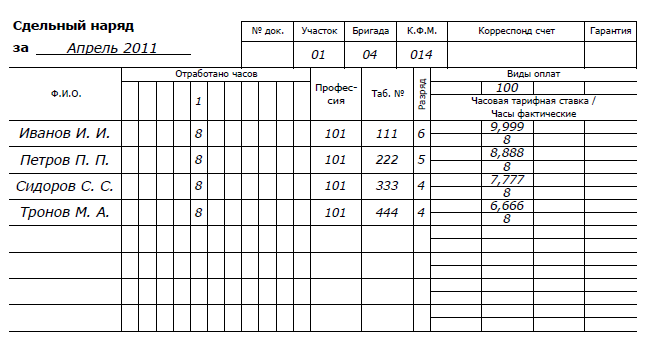

## Реферат

Пояснительная записка — 133 с., количество источников — 2, количество рисунков — 10.
Курсовая работа иллюстрирует процесс разработки программы «АРМ табельщика»,
используемой для учета выполняемых работ, отработанного времени и расчета заработной платы сотрудников ремонтных организаций.

В процессе работы с программой, пользователь вводит данные, которые в последствии доступны для просмотра, изменения или удаления.

Для хранения данных в программе используются файлы баз данных типа .mdb. Предусмотрена реализация механизма защиты целостности данных.

## Содержание

1. [Системный анализ предметной области](#analisys)
2. [Разработка структуры базы данных приложения](#data)
3. [Реализация доступа к данным в приложении](#accsess)
4. [Особенности реализации интерфейса пользователя](#ui)
5. [Руководство пользователя программы «АРМ табельщика»](#man)
6. [Перечень ссылок](#ref)

##<a name="analisys">Системный анализ предметной области</a>

Необходимо разработать приложение для учета выполняемых работ, затрат рабочего времени и расчета заработной платы
работников ремонтных организаций. Учет ведется на основе составления электронных версий нарядов на выполнение работ.
Каждый наряд содержит информацию о заказчике, номер заказа, дату составления или последней редакции наряда,
перечень исполнителей работ, затраченное время и перечень выполненых работ. Образец наряда представлен на рисунках [1](#fig1) и [2](#fig2).

|  |
| :-: |
| Рисунок 1 — Образец наряда (лицевая сторона) |

Каждый элемент перечня исполнителей работ содержит следующую информацию:
- личный табельный номер сотрудника;
- фамилию, имя и отчество сотрудника;
- шифр профессии, по которой сотрудник фигурирует в наряде;
- разряд по указанной профессии.
Каждый элемент перечня затрат времени содержит следующую информацию:
- дату ведения работ;
- время в часах, затраченное на производство работ.

## <a name="data">Разработка структуры базы данных приложения</a>

## <a name="accsess">Реализация доступа к данным в приложении</a>

## <a name="ui">Особенности реализации интерфейса пользователя</a>

## <a name="man">Руководство пользователя программы «АРМ табельщика»</a>

## <a name="ref">Перечень ссылок</a>
