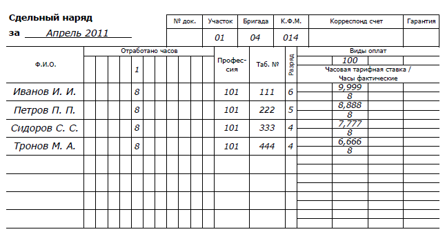
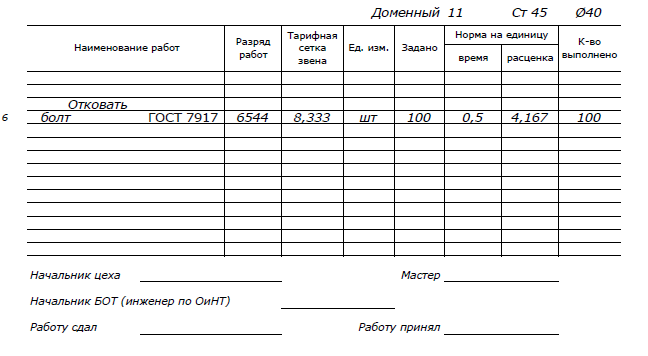
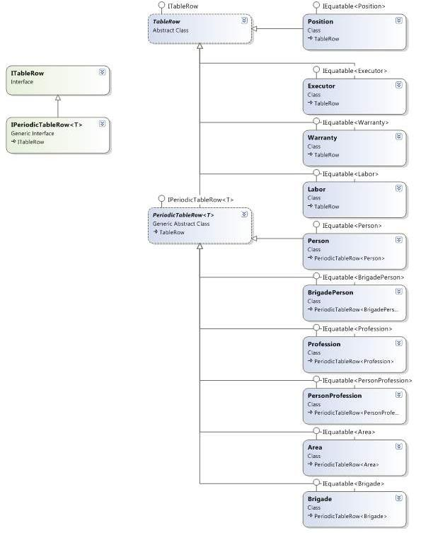
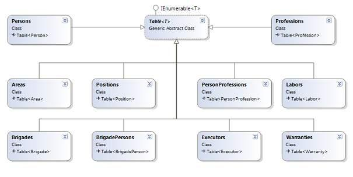
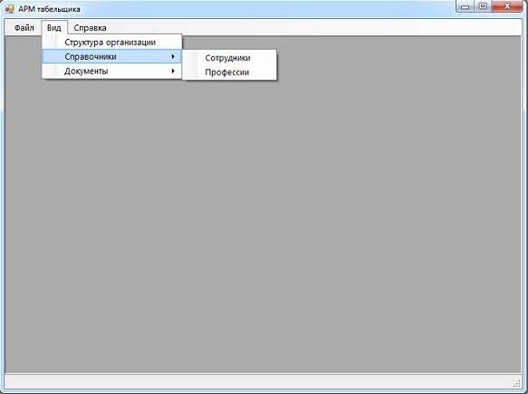
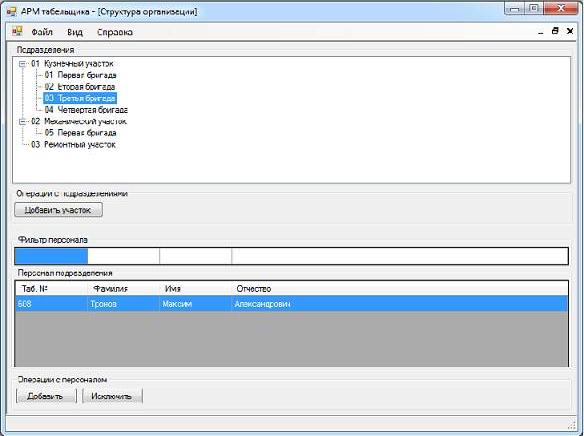
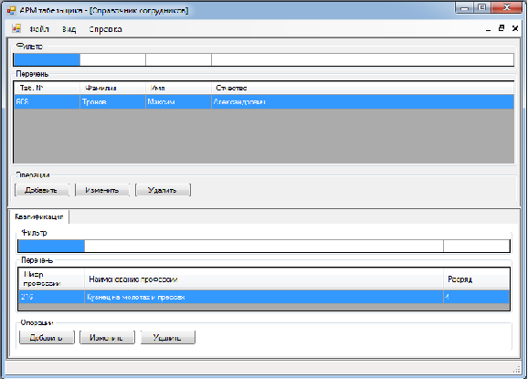
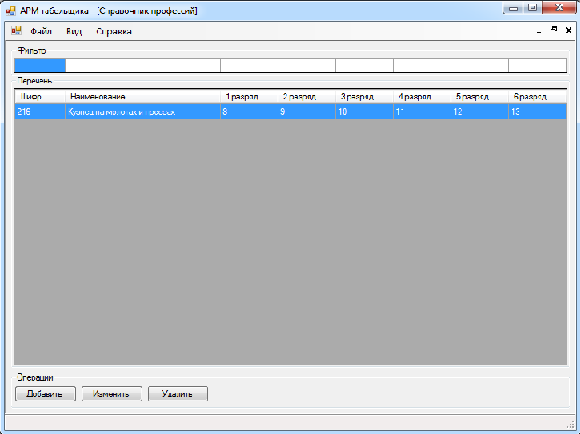
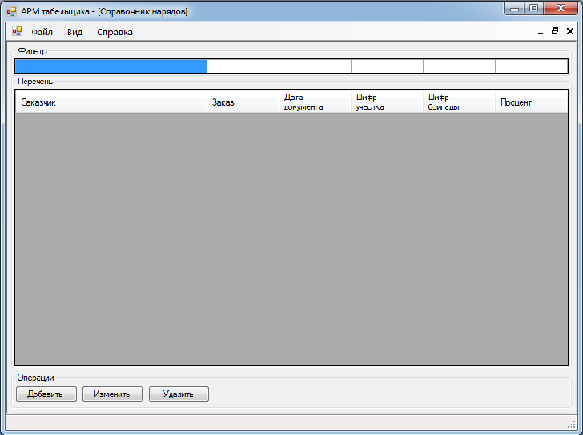
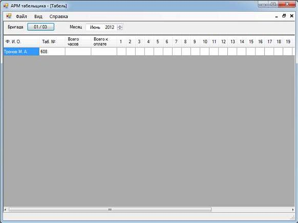

## Реферат

Пояснительная записка — 133 с., количество источников — 2, количество рисунков — 10.
Курсовая работа иллюстрирует процесс разработки программы «АРМ табельщика»,
используемой для учета выполняемых работ, отработанного времени и расчета заработной платы сотрудников ремонтных организаций.

В процессе работы с программой, пользователь вводит данные, которые в последствии доступны для просмотра, изменения или удаления.

Для хранения данных в программе используются файлы баз данных типа .mdb. Предусмотрена реализация механизма защиты целостности данных.

## Содержание

1. [Системный анализ предметной области](#analisys)
2. [Разработка структуры базы данных приложения](#data)
3. [Реализация доступа к данным в приложении](#accsess)
4. [Особенности реализации интерфейса пользователя](#ui)
5. [Руководство пользователя программы «АРМ табельщика»](#man)
6. [Перечень литературы](#lit)

##<a name="analisys">Системный анализ предметной области</a>

Необходимо разработать приложение для учета выполняемых работ, затрат рабочего времени и расчета заработной платы
работников ремонтных организаций. Учет ведется на основе составления электронных версий нарядов на выполнение работ.
Каждый наряд содержит информацию о заказчике, номер заказа, дату составления или последней редакции наряда,
перечень исполнителей работ, затраченное время и перечень выполненых работ. Образец наряда представлен на рисунках [1](#fig1) и [2](#fig2).

|  |
| :-: |
| Рисунок 1 — Образец наряда (лицевая сторона) |

|  |
| :-: |
| Рисунок 2 — Образец наряда (тыльная сторона) |

Каждый элемент перечня исполнителей работ содержит следующую информацию:
- личный табельный номер сотрудника;
- фамилию, имя и отчество сотрудника;
- шифр профессии, по которой сотрудник фигурирует в наряде;
- разряд по указанной профессии.

Каждый элемент перечня затрат времени содержит следующую информацию:
- дату ведения работ;
- время в часах, затраченное на производство работ.

Каждый элемент перечня выполненых работ содержит следующую информацию:
- наименование работ;
- номер чертежа или схемы на произведенные работы;
- количественную составляющую работ;
- норму времени на единицу работ;
- расценку на единицу работ.

В целях обеспечения дружественного пользовательского интерфейса,
необходимо создание вспомогательных справочных таблиц, таких как:
- справочник сотрудников;
- справочник профессий;
- таблица текущего состояния производственной структуры организации.

Необходимо обеспечить возможность генерации табеля выхождаемости сотрудников
на основе данных полученных из нарядов. Табель должен содержать перечень сотрудников
выбранного подразделения с указанием времени отработанного в каждый из дней учетного месяца.
Поскольку просмотр суммарной информации может выявить ошибку в данных,
обусловленую человеческим фактором, необходимо обеспечить оперативный доступ к документам,
содержащим данные на основе которых генерируется табель.

Производственная структура имеет иерархический вид, в котором корнями иерархии являются производственные участки.
Каждый участок может содержать неограниченное количество бригад.
Каждая бригада, в свою очередь, содержит в своем составе сотрудников,
которые замыкают иерархию производственной структуры.

## <a name="data">Разработка структуры базы данных приложения</a>

Использование реляционной базы данных задает ряд ограничений относительно объектных баз данных.
В их числе — необходимость косвенной реализации историчности данных. В случае реляционной
модели историчность (версионность) данных можно обеспечить
посредством добавления дополнительных полей указывающих дату ввода
данных (версию данных). Поскольку справочные данные могут быть
подвержены изменениям, в целях сохранения целостности документов
использующих эти данные, все справочники имеют двойную индексацию в
виде полей «Id» — уникального идентификатора в таблице, и «Code» — шифра
записи, который уникален только на протяжении указанного промежутка
времени. Этот промежуток устанавливается в двух дополнительных полях
каждой таблицы базы данных, используемой справочником.
Таким образом, с учетом требований предъявленных к приложению,
база данных содержит следующие таблицы:

- **_Areas_** — содержит информацию об участках. Включает такие поля как:
  - _Id_ — уникальный идентификатор участка;
  - _Code_ — шифр участка;
  - _Title_ — название участка;
  - _Begin_ — дата создания участка;
  - _End_ — дата удаления участка.

- **_Brigades_** — содержит информацию о бригадах. Включает поля:
  - _Id_ — уникальный идентификатор бригады;
  - _AreaId_ — уникальный идентификатор участка, содержащего данную бригаду;
  - _Code_ — шифр бригады;
  - _Title_ — название бригады;
  - _Begin_ — дата создания бригады;
  - _End_ — дата удаления бригады.

- **_BrigadePersons_** — содержит описания текущих связей сотрудников с бригадами,
иными словами описывает состав каждой бригады в определенный момент времени. Включает поля:
  - _Id_ — уникальный идентификатор связи;
  - _BrigadeId_ — идентификатор бригады;
  - _PersonId_ — идентификатор сотрудника;
  - _Begin_ — дата включения сотрудника в состав бригады;
  - _End_ — дата исключения сотрудника из состава бригады.

- **_Persons_** — содержит данные о сотрудниках:
  - _Id_ — уникальный идентификатор сотрудника;
  - _Code_ — табельный номер сотрудника;
  - _FirstName_ — имя сотрудника;
  - _MiddleName_ — отчество сотрудника;
  - _LastName_ — фамилия сотрудника;
  - _Begin_ — дата приема сотрудника в организацию;
  - _End_ — дата увольнения сотрудника.

- **_PersonProfessions_** — описывает текущую квалификацию сотрудников. Включает поля:
  - _Id_ — уникальный идентификатор связи;
  - _PersonId_ — идентификатор сотрудника;
  - _ProfessionId_ — идентификатор сотрудника;
  - _Begin_ — дата включения сотрудника в состав бригады;
  - _End_ — дата исключения сотрудника из состава бригады.

- **_Professions_** — содержит записи о профессиях и их тарифах, в том числе:
  - _Id_ — уникальный идентификатор профессии;
  - _Code_ — шифр профессии;
  - _Title_ — название профессии;
  - _Rank1_ — тариф первого разряда профессии;
  - _Rank2_ — тариф второго разряда профессии;
  - _Rank3_ — тариф третьего разряда профессии;
  - _Rank4_ — тариф четвертого разряда профессии;
  - _Rank5_ — тариф пятого разряда профессии;
  - _Rank6_ — тариф шестого разряда профессии;
  - _Begin_ — дата начала действия тарифной сетки;
  - _End_ — дата окончания действия тарифной сетки.

- **_Warranties_** — содержит данные о нарядах, выраженные полями:
  - _Id_ — уникальный идентификатор записи;
  - _Customer_ — название заказчика;
  - _Order_ — номер заказа;
  - _WarrantyDate_ — дата последней редакции наряда;
  - _AreaId_ — идентификатор участка на котором производились работы;
  - _BrigadeId_ — идентификатор бригады, производившей работы.

- **_Positions_** — содержит позиции нарядов, выраженные следующимим полями:
  - _Id_ — уникальный идентификатор позиции;
  - _WarrantyId_ — идентификатор наряда, которому принадлежит позиция;
  - _Title_ — наименование работ;
  - _Draw_ — номер чертежа;
  - _Matherial_ — материал, затраченный при производстве работ;
  - _Number_ — количественная составляющая произведенных работ;
  - _Mass_ — масса единицы результата труда;
  - _Norm_ — норма времени на единицу результата труда;
  - _Price_ — расценка на единицу результата труда.

- **_Executors_** — содержит записи об исполнителях работ. Поля таблицы:
  - _Id_ — уникальный идентификатор исполнителя;
  - _WarrantyId_ — идентификатор наряда, которому принадлежит
  - _запись_ о— исполнителе работ;
  - _PersonId_ — идентификатор сотрудника;
  - _ProfessionId_ — идентификатор профессии, по которой сотрудник фигурирует в наряде;
  - _Rank_ — разряд по профессии сотрудника, определенный сложностью работ.

- **_Labors_** — содержит записи о затратах времени, отмеченных в нарядах.
Описана следующими полями:
  - _Id_ — идентификатор записи;
  - _WarrantyId_ — идентификатор наряда, которому соответствует запись;
  - _LaborDate_ — дата ведения работ;
  - _Hours_ — затраченое время.

## <a name="accsess">Реализация доступа к данным в приложении</a>

Среда разработки обладает средством визуального проектирования кэша базы данных в объекте типа `DataSet`.
Однако `DataSet` отображает реляционную структуру данных, а при разработке приложения удобно использовать
объектно-ориентированый источник данных. Поэтому, в приложении был разработан собственный объектный кэш данных.
Его структура описывается нижеуказанными принципами.

Проект  приложения  содержит  три  файла  обеспечивающих взаимодействие приложения с базами данных.
В их число входят:
- файл [Elements.cs](../Project/Databases/Elements.cs) — содержит описание строк каждой из таблиц
базы данных, поддерживающее интерфейсы для проверки эквивалентности строк. Диаграмма классов файла
[Elements.cs](../Project/Databases/Elements.cs) представлена на рисунке [3](#fig3);
- файл [Tables.cs](../Project/Databases/Tables.cs) — содержит методы доступа к данным каждой
таблицы.  Таблицы  в  кэше  поддерживают  интерфейс `System.Collections.Generic.IEnumerable<T>`,
что позволяет с помощью методов расширения получить оперативный доступ к типизированному содержимому таблиц.
Диаграмма классов файла [Tables.cs](../Project/Databases/Tables.cs) представлена на рисунке [4](#fig4);
- файл [Data.cs](../Project/Databases/Tables.cs) содержит механизмы управления базами данных.

|  |
| :-: |
| Рисунок 3 — Диарамма классов файла [Elements.cs](../Project/Databases/Elements.cs) |

|  |
| :-: |
| Рисунок 4 — Диарамма классов файла [Tables.cs](../Project/Databases/Tables.cs) |

## <a name="ui">Особенности реализации интерфейса пользователя</a>

Взаимодействие пользователя с программой происходит в MDI интерфейсе.
Для создания и редактирования строк каждой таблицы текущей базы данных
используется одна форма. В соответствующих формах предусмотрено
открытое свойство `CatalogMode`, настраивающее поведение
и отображение формы в соответствии с выбраной задачей.
Для упрощения проектирования форм обслуживающих справочные
таблицы, создан пользовательский элемент управления `TableControl`
наследующий класс `System.Windows.Forms.UserControl`. Для каждой
справочной таблицы создан пользовательский элемент управления
наследующий `TableControl` и дополняющий его в соответствии со
спецификой таблицы.
Формы отображающие содержимое таблиц базы данных используют
готовые пользовательские элементы управления таблиц.

## <a name="man">Руководство пользователя программы «АРМ табельщика»</a>

При запуске программы, после демонстрации заставки, на экране появляется главная форма, которая содержит в себе пункты главного меню:
- файл;
- вид;
- справка.

Меню «Файл» предоставляет возможность выхода из программы через подпункт «Выход».
Меню «Вид» (рисунок [5](#fig5)) содержит подпункты предоставляющие доступ к форме структуры организации, справочникам и документам.

|  |
| :-: |
| Рисунок 5 — Главная форма приложения и меню «Вид» |

Меню «Справка» предоставляет возможность просмотра сведений о программе через подпункт «О программе».

Далее рассмотрены формы доступные из меню «Вид».

При выборе подпункта меню — «Структура организации», открывается форма «Структура организации» (рисунок [6](#fig6)).
Чтобы добавить участок, необходимо нажать на кнопку «Добавить участок».
Добавление бригад возможно посредством выбора соответствующего пункта контекстного меню после щелчка правой кнопкой мыши на участке. 
Редактирование и удаление участков и бригад также доступно через контекстное меню.

|  |
| :-: |
| Рисунок 6 — Форма «Структура организации» |

При  выборе  подпункта  меню «Справочник  сотрудников», открывается форма «Справочник сотрудников» (рисунок [7](#fig7)).
Редактирование и удаление сотрудников, а также их квалификаций доступно через соответствующие кнопки или через контекстные меню.

|  |
| :-: |
| Рисунок 7 — Форма «Справочник сотрудников» |

При выборе подпункта меню «Справочник профессий», открывается форма «Справочник профессий» (рисунок [8](#fig8)).
Добавление, редактирование и удаление профессий доступно через соответствующие кнопки или через контекстные меню.

|  |
| :-: |
| Рисунок 8 — Форма «Справочник профессий» |

При выборе подпункта меню «Справочник нарядов», открывается форма «Справочник нарядов» (рисунок [9](#fig9)).
Добавление, редактирование и удаление нарядов доступно через соответствующие кнопки или через контекстные меню.

|  |
| :-: |
| Рисунок 9 — Форма «Справочник нарядов» |

При выборе подпункта меню «Табель», открывается форма «Табель» (рисунок [10](#fig10)).
Для генерации табеля необходимо указать интересующую бригаду посредством нажания на кнопку «Бригада»
и выбора отчетного месяца в элементе управления «Месяц».

|  |
| :-: |
| Рисунок 10 — Форма «Табель» |

## <a name="lit">Перечень литературы</a>

1. П. В. Шумаков — ADO.NET и создание приложений баз данных в среде Microsoft Visual Studio .NET. Руководство разработчика с примерами на C#. — М.: ДИАЛОГ-МИФИ, 2003. — 528 с.
2. Д. C. Раттц — LINQ: язык интегрированных запросов в C# 2008 для профессионалов. : Пер. с англ. — М. : ООО "И. Д. Вильямс", 2008. — 560 с. : ил. — Парал. тит. англ.
